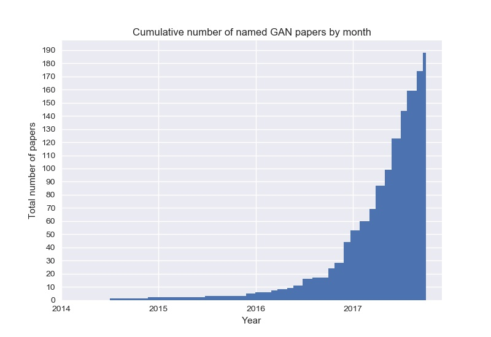

# The Generative Model Zoo

Every week, new GAN,VAE papers are coming out and it's hard to keep track of them all,So, here's a list of what started as a fun activity compiling all named gans,vaes!

You can also check out the same data in a tabular format with functionality to filter by year or do a quick search by title [gan](https://github.com/tangzhenyu/Generative_Model_Zoo/blob/master/gans.tsv),[vae](https://github.com/tangzhenyu/Generative_Model_Zoo/blob/master/vae.tsv).

#### Generative Adversarial Nets (GAN)


* {{ gan['Abbr.'] }} - [{{ gan['Title'] }}]({{ gan['Arxiv'] }})
   
  {#- #} ([github]({{ gan['Official_Code'] }}))
   {# space removed if no github repository #}

  


#### Variational Autoencoder (VAE)


* {{ vae['Abbr.'] }} - [{{ vae['Title'] }}]({{ vae['Arxiv'] }})
   
    {#- #} ([github]({{ vae['Official_Code'] }}))
	   {# space removed if no github repository #}

	    
		

#### Restricted Boltzmann Machine (RBM)
* [Binary RBM with Contrastive Divergence](http://www.cs.toronto.edu/~fritz/absps/cdmiguel.pdf)
* [Binary RBM with Persistent Contrastive Divergence](http://www.cs.toronto.edu/~tijmen/pcd/pcd.pdf)

## Dependencies

1. Install miniconda <http://conda.pydata.org/miniconda.html>
2. Do `conda env create`
3. Enter the env `source activate generative-models`
4. Install [Tensorflow](https://www.tensorflow.org/get_started/os_setup)
5. Install [Pytorch](https://github.com/pytorch/pytorch#installation)
