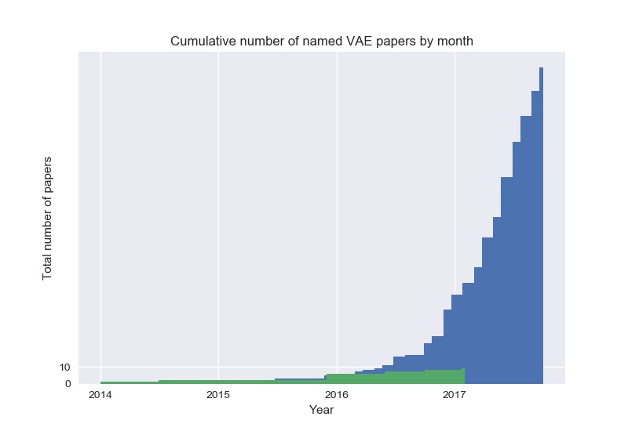

# The Generative Model Zoo

Every week, new GAN,VAE papers are coming out and it's hard to keep track of them all,So, here's a list of what started as a fun activity compiling all named gans,vaes!

## Generative Adversarial Nets (GAN)

#### Overview
- Generative Adversarial Networks: An Overview [[arXiv]](https://arxiv.org/abs/1710.07035)

#### Papers
* Spectral Normalization GAN - [SPECTRAL NORMALIZATION FOR GENERATIVE ADVERSARIAL NETWORKS](https://openreview.net/pdf?id=B1QRgziT-)
* 3D-GAN - [Learning a Probabilistic Latent Space of Object Shapes via 3D Generative-Adversarial Modeling](https://arxiv.org/abs/1610.07584) ([github](https://github.com/zck119/3dgan-release))
* 3D-IWGAN - [Improved Adversarial Systems for 3D Object Generation and Reconstruction](https://arxiv.org/abs/1707.09557) ([github](https://github.com/EdwardSmith1884/3D-IWGAN))
* 3D-RecGAN - [3D Object Reconstruction from a Single Depth View with Adversarial Learning](https://arxiv.org/abs/1708.07969) ([github](https://github.com/Yang7879/3D-RecGAN))
* ABC-GAN - [ABC-GAN: Adaptive Blur and Control for improved training stability of Generative Adversarial Networks](https://drive.google.com/file/d/0B3wEP_lEl0laVTdGcHE2VnRiMlE/view) ([github](https://github.com/IgorSusmelj/ABC-GAN))
* AC-GAN - [Conditional Image Synthesis With Auxiliary Classifier GANs](https://arxiv.org/abs/1610.09585) 
* acGAN - [Face Aging With Conditional Generative Adversarial Networks](https://arxiv.org/abs/1702.01983) 
* AdaGAN - [AdaGAN: Boosting Generative Models](https://arxiv.org/abs/1701.02386v1) 
* AE-GAN - [AE-GAN: adversarial eliminating with GAN](https://arxiv.org/abs/1707.05474) 
* AEGAN - [Learning Inverse Mapping by Autoencoder based Generative Adversarial Nets](https://arxiv.org/abs/1703.10094) 
* AffGAN - [Amortised MAP Inference for Image Super-resolution](https://arxiv.org/abs/1610.04490) 
* AL-CGAN - [Learning to Generate Images of Outdoor Scenes from Attributes and Semantic Layouts](https://arxiv.org/abs/1612.00215) 
* ALI - [Adversarially Learned Inference](https://arxiv.org/abs/1606.00704) 
* AlignGAN - [AlignGAN: Learning to Align Cross-Domain Images with Conditional Generative Adversarial Networks](https://arxiv.org/abs/1707.01400) 
* AM-GAN - [Activation Maximization Generative Adversarial Nets](https://arxiv.org/abs/1703.02000) 
* AnoGAN - [Unsupervised Anomaly Detection with Generative Adversarial Networks to Guide Marker Discovery](https://arxiv.org/abs/1703.05921v1) 
* ARAE - [Adversarially Regularized Autoencoders for Generating Discrete Structures](https://arxiv.org/abs/1706.04223) ([github](https://github.com/jakezhaojb/ARAE))
* ARDA - [Adversarial Representation Learning for Domain Adaptation](https://arxiv.org/abs/1707.01217) 
* ARIGAN - [ARIGAN: Synthetic Arabidopsis Plants using Generative Adversarial Network](https://arxiv.org/abs/1709.00938) 
* ArtGAN - [ArtGAN: Artwork Synthesis with Conditional Categorial GANs](https://arxiv.org/abs/1702.03410) 
* b-GAN - [Generative Adversarial Nets from a Density Ratio Estimation Perspective](https://arxiv.org/abs/1610.02920) 
* Bayesian GAN - [Deep and Hierarchical Implicit Models](https://arxiv.org/abs/1702.08896) 
* Bayesian GAN - [Bayesian GAN](https://arxiv.org/abs/1705.09558) 
* BCGAN - [Bayesian Conditional Generative Adverserial Networks](https://arxiv.org/abs/1706.05477) 
* BEGAN - [BEGAN: Boundary Equilibrium Generative Adversarial Networks](https://arxiv.org/abs/1703.10717) 
* BGAN - [Binary Generative Adversarial Networks for Image Retrieval](https://arxiv.org/abs/1708.04150) ([github](https://github.com/htconquer/BGAN))
* BiGAN - [Adversarial Feature Learning](https://arxiv.org/abs/1605.09782v7) 
* BS-GAN - [Boundary-Seeking Generative Adversarial Networks](https://arxiv.org/abs/1702.08431v1) 
* C-RNN-GAN - [C-RNN-GAN: Continuous recurrent neural networks with adversarial training](https://arxiv.org/abs/1611.09904) ([github](https://github.com/olofmogren/c-rnn-gan/))
* CaloGAN - [CaloGAN: Simulating 3D High Energy Particle Showers in Multi-Layer Electromagnetic Calorimeters with Generative Adversarial Networks](https://arxiv.org/abs/1705.02355) ([github](https://github.com/hep-lbdl/CaloGAN))
* CAN - [CAN: Creative Adversarial Networks, Generating Art by Learning About Styles and Deviating from Style Norms](https://arxiv.org/abs/1706.07068) 
* CatGAN - [Unsupervised and Semi-supervised Learning with Categorical Generative Adversarial Networks](https://arxiv.org/abs/1511.06390v2) 
* CausalGAN - [CausalGAN: Learning Causal Implicit Generative Models with Adversarial Training](https://arxiv.org/abs/1709.02023) 
* CC-GAN - [Semi-Supervised Learning with Context-Conditional Generative Adversarial Networks](https://arxiv.org/abs/1611.06430) ([github](https://github.com/edenton/cc-gan))
* CDcGAN - [Simultaneously Color-Depth Super-Resolution with Conditional Generative Adversarial Network](https://arxiv.org/abs/1708.09105) 
* CGAN - [Conditional Generative Adversarial Nets](https://arxiv.org/abs/1411.1784) 
* CGAN - [Controllable Generative Adversarial Network](https://arxiv.org/abs/1708.00598) 
* Chekhov GAN - [An Online Learning Approach to Generative Adversarial Networks](https://arxiv.org/abs/1706.03269) 
* CoGAN - [Coupled Generative Adversarial Networks](https://arxiv.org/abs/1606.07536v2) 
* Conditional cycleGAN - [Conditional CycleGAN for Attribute Guided Face Image Generation](https://arxiv.org/abs/1705.09966) 
* constrast-GAN - [Generative Semantic Manipulation with Contrasting GAN](https://arxiv.org/abs/1708.00315) 
* Context-RNN-GAN - [Contextual RNN-GANs for Abstract Reasoning Diagram Generation](https://arxiv.org/abs/1609.09444) 
* Coulomb GAN - [Coulomb GANs: Provably Optimal Nash Equilibria via Potential Fields](https://arxiv.org/abs/1708.08819) 
* Cramèr GAN  - [The Cramer Distance as a Solution to Biased Wasserstein Gradients](https://arxiv.org/abs/1705.10743) 
* crVAE-GAN - [Channel-Recurrent Variational Autoencoders](https://arxiv.org/abs/1706.03729) 
* CS-GAN - [Improving Neural Machine Translation with Conditional Sequence Generative Adversarial Nets](https://arxiv.org/abs/1703.04887) 
* CVAE-GAN - [CVAE-GAN: Fine-Grained Image Generation through Asymmetric Training](https://arxiv.org/abs/1703.10155) 
* CycleGAN - [Unpaired Image-to-Image Translation using Cycle-Consistent Adversarial Networks](https://arxiv.org/abs/1703.10593) ([github](https://github.com/junyanz/CycleGAN))
* D2GAN - [Dual Discriminator Generative Adversarial Nets](http://arxiv.org/abs/1709.03831) 
* DAN - [Distributional Adversarial Networks](https://arxiv.org/abs/1706.09549) 
* DCGAN - [Unsupervised Representation Learning with Deep Convolutional Generative Adversarial Networks](https://arxiv.org/abs/1511.06434) ([github](https://github.com/Newmu/dcgan_code))
* DeliGAN - [DeLiGAN : Generative Adversarial Networks for Diverse and Limited Data](https://arxiv.org/abs/1706.02071) ([github](https://github.com/val-iisc/deligan))
* DiscoGAN - [Learning to Discover Cross-Domain Relations with Generative Adversarial Networks](https://arxiv.org/abs/1703.05192v1) 
* DistanceGAN - [One-Sided Unsupervised Domain Mapping](https://arxiv.org/abs/1706.00826) 
* DM-GAN - [Dual Motion GAN for Future-Flow Embedded Video Prediction](https://arxiv.org/abs/1708.00284) 
* DR-GAN - [Representation Learning by Rotating Your Faces](https://arxiv.org/abs/1705.11136) 
* DRAGAN - [How to Train Your DRAGAN](https://arxiv.org/abs/1705.07215) ([github](https://github.com/kodalinaveen3/DRAGAN))
* DSP-GAN - [Depth Structure Preserving Scene Image Generation](https://arxiv.org/abs/1706.00212) 
* DTN - [Unsupervised Cross-Domain Image Generation](https://arxiv.org/abs/1611.02200) 
* DualGAN - [DualGAN: Unsupervised Dual Learning for Image-to-Image Translation](https://arxiv.org/abs/1704.02510v1) 
* Dualing GAN - [Dualing GANs](https://arxiv.org/abs/1706.06216) 
* EBGAN - [Energy-based Generative Adversarial Network](https://arxiv.org/abs/1609.03126v4) 
* ED//GAN - [Stabilizing Training of Generative Adversarial Networks through Regularization](https://arxiv.org/abs/1705.09367) 
* EGAN - [Enhanced Experience Replay Generation for Efficient Reinforcement Learning](https://arxiv.org/abs/1705.08245) 
* ExprGAN - [ExprGAN: Facial Expression Editing with Controllable Expression Intensity](https://arxiv.org/abs/1709.03842) 
* f-GAN - [f-GAN: Training Generative Neural Samplers using Variational Divergence Minimization](https://arxiv.org/abs/1606.00709) 
* FF-GAN - [Towards Large-Pose Face Frontalization in the Wild](https://arxiv.org/abs/1704.06244) 
* Fila-GAN - [Synthesizing Filamentary Structured Images with GANs](https://arxiv.org/abs/1706.02185) 
* Fisher GAN - [Fisher GAN](https://arxiv.org/abs/1705.09675) 
* Flow-GAN - [Flow-GAN: Bridging implicit and prescribed learning in generative models](https://arxiv.org/abs/1705.08868) 
* GAMN - [Generative Adversarial Mapping Networks](https://arxiv.org/abs/1709.09820) 
* GAN - [Generative Adversarial Networks](https://arxiv.org/abs/1406.2661) ([github](https://github.com/goodfeli/adversarial))
* GAN-CLS - [Generative Adversarial Text to Image Synthesis](https://arxiv.org/abs/1605.05396) ([github](https://github.com/reedscot/icml2016))
* GAN-sep - [GANs for Biological Image Synthesis](https://arxiv.org/abs/1708.04692) ([github](https://github.com/aosokin/biogans))
* GAN-VFS - [Generative Adversarial Network-based Synthesis of Visible Faces from Polarimetric Thermal Faces](https://arxiv.org/abs/1708.02681) 
* GANCS - [Deep Generative Adversarial Networks for Compressed Sensing Automates MRI](https://arxiv.org/abs/1706.00051) 
* GAWWN - [Learning What and Where to Draw](https://arxiv.org/abs/1610.02454) ([github](https://github.com/reedscot/nips2016))
* GeneGAN - [GeneGAN: Learning Object Transfiguration and Attribute Subspace from Unpaired Data](https://arxiv.org/abs/1705.04932) ([github](https://github.com/Prinsphield/GeneGAN))
* Geometric GAN - [Geometric GAN](https://arxiv.org/abs/1705.02894) 
* GMAN - [Generative Multi-Adversarial Networks](http://arxiv.org/abs/1611.01673) 
* GMM-GAN - [Towards Understanding the Dynamics of Generative Adversarial Networks](https://arxiv.org/abs/1706.09884) 
* GoGAN - [Gang of GANs: Generative Adversarial Networks with Maximum Margin Ranking](https://arxiv.org/abs/1704.04865) 
* GP-GAN - [GP-GAN: Towards Realistic High-Resolution Image Blending](https://arxiv.org/abs/1703.07195) ([github](https://github.com/wuhuikai/GP-GAN))
* GRAN - [Generating images with recurrent adversarial networks](https://arxiv.org/abs/1602.05110) ([github](https://github.com/jiwoongim/GRAN))
* IAN - [Neural Photo Editing with Introspective Adversarial Networks](https://arxiv.org/abs/1609.07093) ([github](https://github.com/ajbrock/Neural-Photo-Editor))
* IcGAN - [Invertible Conditional GANs for image editing](https://arxiv.org/abs/1611.06355) ([github](https://github.com/Guim3/IcGAN))
* ID-CGAN - [Image De-raining Using a Conditional Generative Adversarial Network](https://arxiv.org/abs/1701.05957v3) 
* iGAN - [Generative Visual Manipulation on the Natural Image Manifold](https://arxiv.org/abs/1609.03552v2) ([github](https://github.com/junyanz/iGAN))
* Improved GAN - [Improved Techniques for Training GANs](https://arxiv.org/abs/1606.03498) ([github](https://github.com/openai/improved-gan))
* InfoGAN - [InfoGAN: Interpretable Representation Learning by Information Maximizing Generative Adversarial Nets](https://arxiv.org/abs/1606.03657v1) ([github](https://github.com/openai/InfoGAN))
* IRGAN - [IRGAN: A Minimax Game for Unifying Generative and Discriminative Information Retrieval models](https://arxiv.org/abs/1705.10513v1) 
* IWGAN - [On Unifying Deep Generative Models](https://arxiv.org/abs/1706.00550) 
* l-GAN - [Representation Learning and Adversarial Generation of 3D Point Clouds](https://arxiv.org/abs/1707.02392) 
* LAGAN - [Learning Particle Physics by Example: Location-Aware Generative Adversarial Networks for Physics Synthesis](https://arxiv.org/abs/1701.05927) 
* LAPGAN - [Deep Generative Image Models using a Laplacian Pyramid of Adversarial Networks](https://arxiv.org/abs/1506.05751) ([github](https://github.com/facebook/eyescream))
* LD-GAN - [Linear Discriminant Generative Adversarial Networks](https://arxiv.org/abs/1707.07831) 
* LDAN - [Label Denoising Adversarial Network (LDAN) for Inverse Lighting of Face Images](https://arxiv.org/abs/1709.01993) 
* LeakGAN - [Long Text Generation via Adversarial Training with Leaked Information](https://arxiv.org/abs/1709.08624) 
* LeGAN - [Likelihood Estimation for Generative Adversarial Networks](https://arxiv.org/abs/1707.07530) 
* LR-GAN - [LR-GAN: Layered Recursive Generative Adversarial Networks for Image Generation](https://arxiv.org/abs/1703.01560v1) 
* LS-GAN - [Loss-Sensitive Generative Adversarial Networks on Lipschitz Densities](https://arxiv.org/abs/1701.06264) 
* LSGAN - [Least Squares Generative Adversarial Networks](https://arxiv.org/abs/1611.04076v3) 
* MAD-GAN - [Multi-Agent Diverse Generative Adversarial Networks](https://arxiv.org/abs/1704.02906) 
* MAGAN - [MAGAN: Margin Adaptation for Generative Adversarial Networks](https://arxiv.org/abs/1704.03817v1) 
* MalGAN - [Generating Adversarial Malware Examples for Black-Box Attacks Based on GAN](https://arxiv.org/abs/1702.05983v1) 
* MaliGAN - [Maximum-Likelihood Augmented Discrete Generative Adversarial Networks](https://arxiv.org/abs/1702.07983) 
* MARTA-GAN - [Deep Unsupervised Representation Learning for Remote Sensing Images](https://arxiv.org/abs/1612.08879) 
* McGAN - [McGan: Mean and Covariance Feature Matching GAN](https://arxiv.org/abs/1702.08398v1) 
* MD-GAN - [Learning to Generate Time-Lapse Videos Using Multi-Stage Dynamic Generative Adversarial Networks](https://arxiv.org/abs/1709.07592) 
* MDGAN - [Mode Regularized Generative Adversarial Networks](https://arxiv.org/abs/1612.02136) 
* MedGAN - [Generating Multi-label Discrete Electronic Health Records using Generative Adversarial Networks](https://arxiv.org/abs/1703.06490v1) 
* MGAN - [Precomputed Real-Time Texture Synthesis with Markovian Generative Adversarial Networks](https://arxiv.org/abs/1604.04382) ([github](https://github.com/chuanli11/MGANs))
* MGGAN - [Multi-Generator Generative Adversarial Nets](https://arxiv.org/abs/1708.02556) 
* MIX+GAN - [Generalization and Equilibrium in Generative Adversarial Nets (GANs)](https://arxiv.org/abs/1703.00573v3) 
* MMD-GAN - [MMD GAN: Towards Deeper Understanding of Moment Matching Network](https://arxiv.org/abs/1705.08584) ([github](https://github.com/dougalsutherland/opt-mmd))
* MMGAN - [MMGAN: Manifold Matching Generative Adversarial Network for Generating Images](https://arxiv.org/abs/1707.08273) 
* MoCoGAN - [MoCoGAN: Decomposing Motion and Content for Video Generation](https://arxiv.org/abs/1707.04993) ([github](https://github.com/sergeytulyakov/mocogan))
* MPM-GAN - [Message Passing Multi-Agent GANs](https://arxiv.org/abs/1612.01294) 
* MuseGAN - [MuseGAN: Symbolic-domain Music Generation and Accompaniment with Multi-track Sequential Generative Adversarial Networks](https://arxiv.org/abs/1709.06298) 
* MV-BiGAN - [Multi-view Generative Adversarial Networks](https://arxiv.org/abs/1611.02019v1) 
* OptionGAN - [OptionGAN: Learning Joint Reward-Policy Options using Generative Adversarial Inverse Reinforcement Learning](https://arxiv.org/abs/1709.06683) 
* ORGAN - [Objective-Reinforced Generative Adversarial Networks (ORGAN) for Sequence Generation Models ](https://arxiv.org/abs/1705.10843) 
* PAN - [Perceptual Adversarial Networks for Image-to-Image Transformation](https://arxiv.org/abs/1706.09138) 
* PassGAN - [PassGAN: A Deep Learning Approach for Password Guessing](https://arxiv.org/abs/1709.00440) 
* Perceptual GAN - [Perceptual Generative Adversarial Networks for Small Object Detection](https://arxiv.org/abs/1706.05274) 
* PGAN - [Probabilistic Generative Adversarial Networks](https://arxiv.org/abs/1708.01886) 
* pix2pix - [Image-to-Image Translation with Conditional Adversarial Networks](https://arxiv.org/abs/1611.07004) ([github](https://github.com/phillipi/pix2pix))
* PixelGAN - [PixelGAN Autoencoders](https://arxiv.org/abs/1706.00531) 
* Pose-GAN - [The Pose Knows: Video Forecasting by Generating Pose Futures](https://arxiv.org/abs/1705.00053) 
* PPGN - [Plug & Play Generative Networks: Conditional Iterative Generation of Images in Latent Space](https://arxiv.org/abs/1612.00005) 
* PrGAN - [3D Shape Induction from 2D Views of Multiple Objects](https://arxiv.org/abs/1612.05872) 
* PSGAN - [Learning Texture Manifolds with the Periodic Spatial GAN](http://arxiv.org/abs/1705.06566) 
* RankGAN - [Adversarial Ranking for Language Generation ](https://arxiv.org/abs/1705.11001) 
* RCGAN - [Real-valued (Medical) Time Series Generation with Recurrent Conditional GANs](https://arxiv.org/abs/1706.02633) 
* RefineGAN - [Compressed Sensing MRI Reconstruction with Cyclic Loss in Generative Adversarial Networks](https://arxiv.org/abs/1709.00753) 
* RenderGAN - [RenderGAN: Generating Realistic Labeled Data](https://arxiv.org/abs/1611.01331) 
* ResGAN - [Generative Adversarial Network based on Resnet for Conditional Image Restoration](https://arxiv.org/abs/1707.04881) 
* RNN-WGAN - [Language Generation with Recurrent Generative Adversarial Networks without Pre-training](https://arxiv.org/abs/1706.01399) ([github](https://github.com/liuyuemaicha/Adversarial-Learning-for-Neural-Dialogue-Generation-in-Tensorflow))
* RPGAN - [Stabilizing GAN Training with Multiple Random Projections](https://arxiv.org/abs/1705.07831) ([github](https://github.com/ayanc/rpgan))
* RTT-GAN - [Recurrent Topic-Transition GAN for Visual Paragraph Generation](https://arxiv.org/abs/1703.07022v2) 
* RWGAN - [Relaxed Wasserstein with Applications to GANs](https://arxiv.org/abs/1705.07164) 
* SAD-GAN - [SAD-GAN: Synthetic Autonomous Driving using Generative Adversarial Networks](https://arxiv.org/abs/1611.08788v1) 
* SalGAN - [SalGAN: Visual Saliency Prediction with Generative Adversarial Networks](https://arxiv.org/abs/1701.01081) ([github](https://github.com/imatge-upc/saliency-salgan-2017))
* SBADA-GAN - [From source to target and back: symmetric bi-directional adaptive GAN](https://arxiv.org/abs/1705.08824) 
* SD-GAN - [Semantically Decomposing the Latent Spaces of Generative Adversarial Networks](https://arxiv.org/abs/1705.07904) 
* SEGAN - [SEGAN: Speech Enhancement Generative Adversarial Network](https://arxiv.org/abs/1703.09452v1) 
* SeGAN - [SeGAN: Segmenting and Generating the Invisible](https://arxiv.org/abs/1703.10239) 
* SegAN - [SegAN: Adversarial Network with Multi-scale L1 Loss for Medical Image Segmentation](https://arxiv.org/abs/1706.01805) 
* SeqGAN - [SeqGAN: Sequence Generative Adversarial Nets with Policy Gradient](https://arxiv.org/abs/1609.05473v5) ([github](https://github.com/LantaoYu/SeqGAN))
* SGAN - [Texture Synthesis with Spatial Generative Adversarial Networks](https://arxiv.org/abs/1611.08207) 
* SGAN - [Stacked Generative Adversarial Networks](https://arxiv.org/abs/1612.04357v4) ([github](https://github.com/xunhuang1995/SGAN))
* SGAN - [Steganographic Generative Adversarial Networks](https://arxiv.org/abs/1703.05502) 
* SimGAN - [Learning from Simulated and Unsupervised Images through Adversarial Training](https://arxiv.org/abs/1612.07828) 
* SketchGAN - [Adversarial Training For Sketch Retrieval](https://arxiv.org/abs/1607.02748) 
* SL-GAN - [Semi-Latent GAN: Learning to generate and modify facial images from attributes](https://arxiv.org/abs/1704.02166) 
* SN-GAN - [Spectral Normalization for Generative Adversarial Networks](https://drive.google.com/file/d/0B8HZ50DPgR3eSVV6YlF3XzQxSjQ/view) ([github](https://github.com/pfnet-research/chainer-gan-lib))
* Softmax-GAN - [Softmax GAN](https://arxiv.org/abs/1704.06191) 
* Splitting GAN - [Class-Splitting Generative Adversarial Networks](https://arxiv.org/abs/1709.07359) 
* SRGAN - [Photo-Realistic Single Image Super-Resolution Using a Generative Adversarial Network](https://arxiv.org/abs/1609.04802) 
* SS-GAN - [Semi-supervised Conditional GANs](https://arxiv.org/abs/1708.05789) 
* ss-InfoGAN - [Guiding InfoGAN with Semi-Supervision](https://arxiv.org/abs/1707.04487) 
* SSGAN - [SSGAN: Secure Steganography Based on Generative Adversarial Networks](https://arxiv.org/abs/1707.01613) 
* SSL-GAN - [Semi-Supervised Learning with Context-Conditional Generative Adversarial Networks](https://arxiv.org/abs/1611.06430v1) 
* ST-GAN - [Style Transfer Generative Adversarial Networks: Learning to Play Chess Differently](https://arxiv.org/abs/1702.06762) 
* StackGAN - [StackGAN: Text to Photo-realistic Image Synthesis with Stacked Generative Adversarial Networks](https://arxiv.org/abs/1612.03242v1) 
* SteinGAN - [Learning Deep Energy Models: Contrastive Divergence vs. Amortized MLE](https://arxiv.org/abs/1707.00797) 
* S^2GAN - [Generative Image Modeling using Style and Structure Adversarial Networks](https://arxiv.org/abs/1603.05631v2) 
* TAC-GAN - [TAC-GAN - Text Conditioned Auxiliary Classifier Generative Adversarial Network](https://arxiv.org/abs/1703.06412v2) ([github](https://github.com/dashayushman/TAC-GAN))
* TAN - [Outline Colorization through Tandem Adversarial Networks](https://arxiv.org/abs/1704.08834) 
* TextureGAN - [TextureGAN: Controlling Deep Image Synthesis with Texture Patches](https://arxiv.org/abs/1706.02823) 
* TGAN - [Temporal Generative Adversarial Nets](https://arxiv.org/abs/1611.06624v1) 
* TP-GAN - [Beyond Face Rotation: Global and Local Perception GAN for Photorealistic and Identity Preserving Frontal View Synthesis](https://arxiv.org/abs/1704.04086) 
* Triple-GAN - [Triple Generative Adversarial Nets](https://arxiv.org/abs/1703.02291v2) 
* Unrolled GAN - [Unrolled Generative Adversarial Networks](https://arxiv.org/abs/1611.02163) ([github](https://github.com/poolio/unrolled_gan))
* VAE-GAN - [Autoencoding beyond pixels using a learned similarity metric](https://arxiv.org/abs/1512.09300) 
* VariGAN - [Multi-View Image Generation from a Single-View](https://arxiv.org/abs/1704.04886) 
* VAW-GAN - [Voice Conversion from Unaligned Corpora using Variational Autoencoding Wasserstein Generative Adversarial Networks](https://arxiv.org/abs/1704.00849) 
* VEEGAN - [VEEGAN: Reducing Mode Collapse in GANs using Implicit Variational Learning](https://arxiv.org/abs/1705.07761) ([github](https://github.com/akashgit/VEEGAN))
* VGAN - [Generating Videos with Scene Dynamics](https://arxiv.org/abs/1609.02612) ([github](https://github.com/cvondrick/videogan))
* VGAN - [Generative Adversarial Networks as Variational Training of Energy Based Models](https://arxiv.org/abs/1611.01799) ([github](https://github.com/Shuangfei/vgan))
* ViGAN - [Image Generation and Editing with Variational Info Generative Adversarial Networks](https://arxiv.org/abs/1701.04568v1) 
* VIGAN - [VIGAN: Missing View Imputation with Generative Adversarial Networks](https://arxiv.org/abs/1708.06724) 
* VRAL - [Variance Regularizing Adversarial Learning](https://arxiv.org/abs/1707.00309) 
* WaterGAN - [WaterGAN: Unsupervised Generative Network to Enable Real-time Color Correction of Monocular Underwater Images](https://arxiv.org/abs/1702.07392v1) 
* WGAN - [Wasserstein GAN](https://arxiv.org/abs/1701.07875v2) ([github](https://github.com/martinarjovsky/WassersteinGAN))
* WGAN-GP - [Improved Training of Wasserstein GANs](https://arxiv.org/abs/1704.00028) ([github](https://github.com/igul222/improved_wgan_training))
* WS-GAN - [Weakly Supervised Generative Adversarial Networks for 3D Reconstruction ](https://arxiv.org/abs/1705.10904) 
* Δ-GAN - [Triangle Generative Adversarial Networks](https://arxiv.org/abs/1709.06548) 
* α-GAN - [Variational Approaches for Auto-Encoding Generative Adversarial Networks](https://arxiv.org/abs/1706.04987) ([github](https://github.com/victor-shepardson/alpha-GAN))

#### Others
- Stopping GAN Violence: Generative Unadversarial Networks [[arXiv]](https://arxiv.org/abs/1703.02528)

#### Recommendations
<ul>
<li>Beyond Face Rotation: Global and Local Perception GAN for Photorealistic and Identity Preserving Frontal View Synthesis <a href="https://arxiv.org/abs/1704.04086">[arXiv]</a> 
</li>

<li>Pose Guided Person Image Generation <a href="https://arxiv.org/abs/1705.09368">[arXiv]</a> 
</li>

<li>Unpaired Image-to-Image Translation using Cycle-Consistent Adversarial Networks <a href="https://arxiv.org/abs/1703.10593">[arXiv]</a>  
</li>
</ul>

#### Tutorials & Workshops & Blogs
- Columbia Advanced Machine Learning Seminar
  - New Progress on GAN Theory and Practice [[Blog]](https://casmls.github.io/general/2017/04/13/gan.html)
  - Implicit Generative Models — What are you GAN-na do? [[Blog]](https://casmls.github.io/general/2017/05/24/ligm.html)
- How to Train a GAN? Tips and tricks to make GANs work [[Blog]](https://github.com/soumith/ganhacks)
- NIPS 2016 Tutorial: Generative Adversarial Networks [[arXiv]](https://arxiv.org/abs/1701.00160)
- NIPS 2016 Workshop on Adversarial Training [[Web]](https://sites.google.com/site/nips2016adversarial/) [[Blog]](http://www.inference.vc/my-summary-of-adversarial-training-nips-workshop/)
- On the intuition behind deep learning & GANs — towards a fundamental understanding [[Blog]](https://blog.waya.ai/introduction-to-gans-a-boxing-match-b-w-neural-nets-b4e5319cc935)
- OpenAI - Generative Models [[Blog]](https://openai.com/blog/generative-models/)
- SimGANs - a game changer in unsupervised learning, self driving cars, and more [[Blog]](https://blog.waya.ai/simgans-applied-to-autonomous-driving-5a8c6676e36b)

#### Videos
- Generative Adversarial Networks by Ian Goodfellow [[Video]](https://channel9.msdn.com/Events/Neural-Information-Processing-Systems-Conference/Neural-Information-Processing-Systems-Conference-NIPS-2016/Generative-Adversarial-Networks)
- Tutorial on Generative Adversarial Networks by Mark Chang [[Video]](https://www.youtube.com/playlist?list=PLeeHDpwX2Kj5Ugx6c9EfDLDojuQxnmxmU)

#### Code
- Cleverhans: A library for benchmarking vulnerability to adversarial examples [[Code]](https://github.com/openai/cleverhans) [[Blog]](http://cleverhans.io/)
- Generative Adversarial Networks (GANs) in 50 lines of code (PyTorch) [[Blog]](https://medium.com/@devnag/generative-adversarial-networks-gans-in-50-lines-of-code-pytorch-e81b79659e3f) [[Code]](https://github.com/devnag/pytorch-generative-adversarial-networks)
- Generative Models: Collection of generative models, e.g. GAN, VAE in Pytorch and Tensorflow [[Code]](https://github.com/wiseodd/generative-models)

## Applied Vision
- 3D Object Reconstruction from a Single Depth View with Adversarial Learning [[arXiv]](https://arxiv.org/abs/1708.07969)
- 3D Shape Induction from 2D Views of Multiple Objects [[arXiv]](https://arxiv.org/abs/1612.05872)
- A step towards procedural terrain generation with GANs [[arXiv]](https://arxiv.org/abs/1707.03383) [[Code]](https://github.com/christopher-beckham/gan-heightmaps)
- Abnormal Event Detection in Videos using Generative Adversarial Nets [[arXiv]](https://arxiv.org/abs/1708.09644)
- Adversarial Generation of Training Examples for Vehicle License Plate Recognition [[arXiv]](https://arxiv.org/abs/1707.03124)
- Adversarial nets with perceptual losses for text-to-image synthesis [[arXiv]](https://arxiv.org/abs/1708.09321)
- Adversarial Networks for Spatial Context-Aware Spectral Image Reconstruction from RGB [[arXiv]](https://arxiv.org/abs/1709.00265)
- Adversarial Networks for the Detection of Aggressive Prostate Cancer [[arXiv]](https://arxiv.org/abs/1702.08014)
- Adversarial PoseNet: A Structure-aware Convolutional Network for Human Pose Estimation [[arXiv]](https://arxiv.org/pdf/1705.00389.pdf)
- Adversarial Training For Sketch Retrieval [[arXiv]](https://arxiv.org/abs/1607.02748)
- Aesthetic-Driven Image Enhancement by Adversarial Learning [[arXiv]](https://arxiv.org/abs/1707.05251)
- Age Progression / Regression by Conditional Adversarial Autoencoder [[arXiv]](https://arxiv.org/abs/1702.08423)
- AlignGAN: Learning to Align Cross-Domain Images with Conditional Generative Adversarial Networks [[arXiv]](https://arxiv.org/abs/1707.01400)
- Amortised MAP Inference for Image Super-resolution [[arXiv]](https://arxiv.org/abs/1610.04490)
- Anti-Makeup: Learning A Bi-Level Adversarial Network for Makeup-Invariant Face Verification [[arXiv]](https://arxiv.org/abs/1709.03654)
- ARIGAN: Synthetic Arabidopsis Plants using Generative Adversarial Network [[arXiv]](https://arxiv.org/abs/1709.00938)
- ArtGAN: Artwork Synthesis with Conditional Categorial GANs [[arXiv]](https://arxiv.org/abs/1702.03410)
- Auto-Encoder Guided GAN for Chinese Calligraphy Synthesis [[arXiv]](https://arxiv.org/abs/1706.08789)
- Auto-painter: Cartoon Image Generation from Sketch by Using Conditional Generative Adversarial Networks [[arXiv]](https://arxiv.org/abs/1705.01908)
- Automatic Liver Segmentation Using an Adversarial Image-to-Image Network [[arXiv]](https://arxiv.org/abs/1707.08037)
- Beyond Face Rotation: Global and Local Perception GAN for Photorealistic and Identity Preserving Frontal View Synthesis [[arXiv]](https://arxiv.org/abs/1704.04086)
- CAN: Creative Adversarial Networks Generating “Art” by Learning About Styles and Deviating from Style Norms [[arXiv]](https://arxiv.org/abs/1706.07068)
- Compressed Sensing MRI Reconstruction with Cyclic Loss in Generative Adversarial Networks [[arXiv]](https://arxiv.org/abs/1709.00753)
- Conditional Adversarial Network for Semantic Segmentation of Brain Tumor [[arXiv]](https://arxiv.org/abs/1708.05227)
- Conditional generative adversarial nets for convolutional face generation [[Paper]](http://www.foldl.me/uploads/2015/conditional-gans-face-generation/paper.pdf)
- Conditional Image Synthesis with Auxiliary Classifier GANs [[Paper]](https://c4209155-a-62cb3a1a-s-sites.googlegroups.com/site/nips2016adversarial/WAT16_paper_7.pdf) [[arXiv]](https://arxiv.org/abs/1610.09585) [[Code]](https://github.com/wiseodd/generative-models)
- Contextual RNN-GANs for Abstract Reasoning Diagram Generation [[arXiv]](https://arxiv.org/abs/1609.09444)
- Controllable Generative Adversarial Network [[arXiv]](https://arxiv.org/abs/1708.00598)
- Creatism: A deep-learning photographer capable of creating professional work [[arXiv]](https://arxiv.org/abs/1707.03491)
- Crossing Nets: Combining GANs and VAEs with a Shared Latent Space for Hand Pose Estimation [[arXiv]](https://arxiv.org/abs/1702.03431)
- CVAE-GAN: Fine-Grained Image Generation through Asymmetric Training [[arXiv]](https://arxiv.org/abs/1703.10155)
- Deep Generative Adversarial Compression Artifact Removal [[arXiv]](https://arxiv.org/abs/1704.02518)
- Deep Generative Adversarial Networks for Compressed Sensing (GANCS) Automates MRI [[arXiv]](https://arxiv.org/abs/1706.00051)
- Deep Generative Adversarial Neural Networks for Realistic Prostate Lesion MRI Synthesis [[arXiv]](https://arxiv.org/abs/1708.00129)
- Deep Generative Image Models using a Laplacian Pyramid of Adversarial Networks [[arXiv]](https://arxiv.org/abs/1506.05751) [[Code]](https://github.com/facebook/eyescream) [[Blog]](http://soumith.ch/eyescream/)
- Deep multi-scale video prediction beyond mean square error [[arXiv]](https://arxiv.org/abs/1511.05440) [[Code]](https://github.com/dyelax/Adversarial_Video_Generation)
- Deep Unsupervised Representation Learning for Remote Sensing Images [[arXiv]](https://arxiv.org/abs/1612.08879)
- DeLiGAN : Generative Adversarial Networks for Diverse and Limited Data [[arXiv]](https://arxiv.org/abs/1706.02071)
- Depth Structure Preserving Scene Image Generation [[arXiv]](https://arxiv.org/abs/1706.00212)
- DualGAN: Unsupervised Dual Learning for Image-to-Image Translation [[arXiv]](https://arxiv.org/abs/1704.02510) [[Code]](https://github.com/wiseodd/generative-models)
- Dual Motion GAN for Future-Flow Embedded Video Prediction [[arXiv]](https://arxiv.org/abs/1708.00284)
- ExprGAN: Facial Expression Editing with Controllable Expression Intensity [[arXiv]](https://arxiv.org/abs/1709.03842)
- Face Aging With Conditional Generative Adversarial Networks [[arXiv]](https://arxiv.org/abs/1702.01983)
- Filmy Cloud Removal on Satellite Imagery with Multispectral Conditional Generative Adversarial Nets [[arXiv]](https://arxiv.org/abs/1710.04835)
- Freehand Ultrasound Image Simulation with Spatially-Conditioned Generative Adversarial Networks [[arXiv]](https://arxiv.org/abs/1707.05392)
- From source to target and back: symmetric bi-directional adaptive GAN [[arXiv]](https://arxiv.org/abs/1705.08824)
- Full Resolution Image Compression with Recurrent Neural Networks [[arXiv]](https://arxiv.org/abs/1608.05148)
- GANs for Biological Image Synthesis [[arXiv]](https://arxiv.org/abs/1708.04692)
- GeneGAN: Learning Object Transfiguration and Attribute Subspace from Unpaired Data [[arXiv]](https://arxiv.org/abs/1705.04932) [[Code]](https://github.com/Prinsphield/GeneGAN)
- Generate Identity-Preserving Faces by Generative Adversarial Networks [[arXiv]](https://arxiv.org/abs/1706.03227)
- Generate To Adapt: Aligning Domains using Generative Adversarial Networks [[arXiv]](https://arxiv.org/abs/1704.01705)
- Generative Adversarial Models for People Attribute Recognition in Surveillance [[arXiv]](https://arxiv.org/abs/1707.02240)
- Generative Adversarial Network based on Resnet for Conditional Image Restoration [[arxiv]](https://arxiv.org/abs/1707.04881)
- Generative Adversarial Network-based Synthesis of Visible Faces from Polarimetric Thermal Faces [[arXiv]](https://arxiv.org/abs/1708.02681)
- Generative Adversarial Networks for Multimodal Representation Learning in Video Hyperlinking [[arXiv]](https://arxiv.org/abs/1705.05103)
- Generative Adversarial Text to Image Synthesis [[arXiv]](https://arxiv.org/abs/1605.05396) [[Code]](https://github.com/paarthneekhara/text-to-image)
- Generative Visual Manipulation on the Natural Image Manifold [[Project]](http://www.eecs.berkeley.edu/~junyanz/projects/gvm/) [[Youtube]](https://youtu.be/9c4z6YsBGQ0) [[Paper]](https://arxiv.org/abs/1609.03552) [[Code]](https://github.com/junyanz/iGAN)
- GP-GAN: Gender Preserving GAN for Synthesizing Faces from Landmarks [[arXiv]](https://arxiv.org/abs/1710.00962)
- GP-GAN: Towards Realistic High-Resolution Image Blending [[arXiv]](https://arxiv.org/abs/1703.07195)
- Guiding InfoGAN with Semi-Supervision [[arXiv]](https://arxiv.org/abs/1707.04487)
- Hierarchical Detail Enhancing Mesh-Based Shape Generation with 3D Generative Adversarial Network [[arXiv]](https://arxiv.org/abs/1709.07581)
- High-Quality Face Image SR Using Conditional Generative Adversarial Networks [[arXiv]](https://arxiv.org/abs/1707.00737)
- Image De-raining Using a Conditional Generative Adversarial Network [[arXiv]](https://arxiv.org/abs/1701.05957)
- Image Generation and Editing with Variational Info Generative Adversarial Networks [[arXiv]](https://arxiv.org/abs/1701.04568)
- Image-to-Image Translation with Conditional Adversarial Networks [[arXiv]](https://arxiv.org/abs/1611.07004) [[Code]](https://github.com/phillipi/pix2pix)
- Improved Adversarial Systems for 3D Object Generation and Reconstruction [[arXiv]](https://arxiv.org/abs/1707.09557) [[Code]](https://github.com/EdwardSmith1884/3D-IWGAN)
- Improving Heterogeneous Face Recognition with Conditional Adversarial Networks [[arXiv]](https://arxiv.org/abs/1709.02848)
- Improving image generative models with human interactions [[arXiv]](https://arxiv.org/abs/1709.10459)
- Imitating Driver Behavior with Generative Adversarial Networks [[arXiv]](https://arxiv.org/abs/1701.06699)
- Interactive 3D Modeling with a Generative Adversarial Network [[arXiv]](https://arxiv.org/abs/1706.05170)
- Intraoperative Organ Motion Models with an Ensemble of Conditional Generative Adversarial Networks [[arXiv]](https://arxiv.org/abs/1709.02255)
- Invertible Conditional GANs for image editing [[arXiv]](https://arxiv.org/abs/1611.06355) [[Paper]](https://c4209155-a-62cb3a1a-s-sites.googlegroups.com/site/nips2016adversarial/WAT16_paper_8.pdf)
- Label Denoising Adversarial Network (LDAN) for Inverse Lighting of Face Images [[arXiv]](https://arxiv.org/abs/1709.01993)
- Learning a Driving Simulator [[arXiv]](https://arxiv.org/abs/1608.01230)
- Learning a Generative Adversarial Network for High Resolution Artwork Synthesis [[arXiv]](https://arxiv.org/abs/1708.09533)
- Learning a Probabilistic Latent Space of Object Shapes via 3D Generative-Adversarial Modeling [[arXiv]](https://arxiv.org/abs/1610.07584)
- Learning from Simulated and Unsupervised Images through Adversarial Training [[arXiv]](https://arxiv.org/abs/1612.07828)
- Learning to Discover Cross-Domain Relations with Generative Adversarial Networks [[arXiv]](https://arxiv.org/abs/1703.05192)
- Learning to Generate Chairs with Generative Adversarial Nets [[arXiv]](https://arxiv.org/abs/1705.10413)
- Learning to Generate Time-Lapse Videos Using Multi-Stage Dynamic Generative Adversarial Networks [[arXiv]](https://arxiv.org/abs/1709.07592)
- Low Dose CT Image Denoising Using a Generative Adversarial Network with Wasserstein Distance and Perceptual Loss [[arXiv]](https://arxiv.org/abs/1708.00961)
- Megapixel Size Image Creation using Generative Adversarial Networks [[arXiv]](https://arxiv.org/abs/1706.00082)
- Microscopy Cell Segmentation via Adversarial Neural Networks [[arXiv]](https://arxiv.org/abs/1709.05860)
- MoCoGAN: Decomposing Motion and Content for Video Generation [[arXiv]](https://arxiv.org/abs/1707.04993)
- Multi-view Generative Adversarial Networks [[Paper]](https://c4209155-a-62cb3a1a-s-sites.googlegroups.com/site/nips2016adversarial/WAT16_paper_13.pdf)
- Neural Photo Editing with Introspective Adversarial Networks [[Paper]](https://c4209155-a-62cb3a1a-s-sites.googlegroups.com/site/nips2016adversarial/WAT16_paper_15.pdf) [[arXiv]](https://arxiv.org/abs/1609.07093)
- Outline Colorization through Tandem Adversarial Networks [[arXiv]](https://arxiv.org/abs/1704.08834)
- Perceptual Adversarial Networks for Image-to-Image Transformation [[arXiv]](https://arxiv.org/abs/1706.09138)
- Perceptual Generative Adversarial Networks for Small Object Detection [[arXiv]](https://arxiv.org/abs/1706.05274)
- Photo-Realistic Single Image Super-Resolution Using a Generative Adversarial Network [[arXiv]](https://arxiv.org/abs/1609.04802)
- Pose Guided Person Image Generation [[arXiv]](https://arxiv.org/abs/1705.09368)
- Precomputed Real-Time Texture Synthesis with Markovian Generative Adversarial Networks [[arXiv]](https://arxiv.org/abs/1604.04382)
- Recurrent Topic-Transition GAN for Visual Paragraph Generation [[arXiv]](https://arxiv.org/abs/1703.07022)
- RenderGAN: Generating Realistic Labeled Data [[arXiv]](https://arxiv.org/abs/1611.01331)
- Representation Learning and Adversarial Generation of 3D Point Clouds [[arXiv]](https://arxiv.org/abs/1707.02392)
- Retinal Vasculature Segmentation Using Local Saliency Maps and Generative Adversarial Networks For Image Super Resolution [[arXiv]](https://arxiv.org/abs/1710.04783)
- Retinal Vessel Segmentation in Fundoscopic Images with Generative Adversarial Networks [[arXiv]](https://arxiv.org/abs/1706.09318)
- SAD-GAN: Synthetic Autonomous Driving using Generative Adversarial Networks [[arXiv]](https://arxiv.org/abs/1611.08788)
- SalGAN: Visual Saliency Prediction with Generative Adversarial Networks [[arXiv]](https://arxiv.org/abs/1701.01081v2)
- SegAN: Adversarial Network with Multi-scale L1 Loss for Medical Image Segmentation [[arXiv]](https://arxiv.org/abs/1706.01805)
- SeGAN: Segmenting and Generating the Invisible [[arXiv]](https://arxiv.org/abs/1703.10239)
- Semantic Image Inpainting with Deep Generative Models [[arXiv]](https://arxiv.org/abs/1607.07539)
- Semantic Image Synthesis via Adversarial Learning [[arXiv]](https://arxiv.org/abs/1707.06873)
- Semantic Segmentation using Adversarial Networks [[arXiv]](https://arxiv.org/abs/1611.08408)
- Semantically Decomposing the Latent Spaces of Generative Adversarial Networks [[arXiv]](https://arxiv.org/abs/1705.07904)
- Semi-Latent GAN: Learning to generate and modify facial images from attributes [[arXiv]](https://arxiv.org/abs/1704.02166)
- Semi-Supervised Learning with Context-Conditional Generative Adversarial Networks [[arXiv]](https://arxiv.org/abs/1611.06430)
- Sharpness-aware Low dose CT denoising using conditional generative adversarial network [[arXiv]](https://arxiv.org/abs/1708.06453)
- Simultaneously Color-Depth Super-Resolution with Conditional Generative Adversarial Network [[arXiv]](https://arxiv.org/abs/1708.09105)
- Socially-compliant Navigation through Raw Depth Inputs with Generative Adversarial Imitation Learning [[arXiv]](https://arxiv.org/abs/1710.02543)
- StackGAN: Text to Photo-realistic Image Synthesis with Stacked Generative Adversarial Networks [[arXiv]](https://arxiv.org/abs/1612.03242)
- Style Transfer for Sketches with Enhanced Residual U-net and Auxiliary Classifier GAN [[arXiv]](https://arxiv.org/abs/1706.03319)
- Supervised Adversarial Networks for Image Saliency Detection [[arXiv]](https://arxiv.org/abs/1704.07242)
- Synthesis of Positron Emission Tomography (PET) Images via Multi-channel Generative Adversarial Networks (GANs) [[arXiv]](https://arxiv.org/abs/1707.09747)
- Synthesizing Filamentary Structured Images with GANs [[arXiv]](https://arxiv.org/abs/1706.02185)
- Synthetic Medical Images from Dual Generative Adversarial Networks [[arXiv]](https://arxiv.org/abs/1709.01872)
- TAC-GAN - Text Conditioned Auxiliary Classifier Generative Adversarial Network [[arXiv]](https://arxiv.org/abs/1703.06412)
- Temporal Generative Adversarial Nets with Singular Value Clipping [[arXiv]](https://arxiv.org/abs/1611.06624)
- TextureGAN: Controlling Deep Image Synthesis with Texture Patches [[arXiv]](https://arxiv.org/abs/1706.02823)
- Texture Synthesis with Spatial Generative Adversarial Networks [[arXiv]](https://arxiv.org/abs/1611.08207v3) [[Code]](https://github.com/ubergmann/spatial_gan)
- The Conditional Analogy GAN: Swapping Fashion Articles on People Images [[arXiv]](https://arxiv.org/abs/1709.04695)
- Towards Adversarial Retinal Image Synthesis [[arXiv]](https://arxiv.org/abs/1701.08974) [[Code]](https://github.com/costapt/vess2ret) [[Demo]](http://vess2ret.inesctec.pt/retina)
- Towards Diverse and Natural Image Descriptions via a Conditional GAN [[arXiv]](https://arxiv.org/abs/1703.06029)
- Towards the Automatic Anime Characters Creation with Generative Adversarial Networks [[arXiv]](https://arxiv.org/abs/1708.05509)
- Unlabeled Samples Generated by GAN Improve the Person Re-identification Baseline in vitro [[arXiv]](https://arxiv.org/abs/1701.07717)
- Unpaired Image-to-Image Translation using Cycle-Consistent Adversarial Networks [[arXiv]](https://arxiv.org/abs/1703.10593)
- Unsupervised and Semi-supervised Learning with Categorical Generative Adversarial Networks [[arXiv]](https://arxiv.org/abs/1511.06390)
- Unsupervised Anomaly Detection with Generative Adversarial Networks to Guide Marker Discovery [[arXiv]](https://arxiv.org/abs/1703.05921)
- Unsupervised Cross-Domain Image Generation [[arXiv]](https://arxiv.org/abs/1611.02200)
- Unsupervised Diverse Colorization via Generative Adversarial Networks [[arXiv]](https://arxiv.org/abs/1702.06674)
- Unsupervised Pixel–Level Domain Adaptation with Generative Adversarial Networks [[arXiv]](https://arxiv.org/abs/1612.05424)
- Unsupervised Visual Attribute Transfer with Reconfigurable Generative Adversarial Networks [[arXiv]](https://arxiv.org/abs/1707.09798)
- VIGAN: Missing View Imputation with Generative Adversarial Networks [[arXiv]](https://arxiv.org/abs/1708.06724)
- WaterGAN: Unsupervised Generative Network to Enable Real-time Color Correction of Monocular Underwater Images [[arXiv]](https://arxiv.org/abs/1702.07392)
- Weakly Supervised Generative Adversarial Networks for 3D Reconstruction [[arXiv]](https://arxiv.org/abs/1705.10904)

## Applied Other
- Adversarial Generation of Natural Language [[arXiv]](https://arxiv.org/abs/1705.10929)
- Adversarial Ranking for Language Generation [[arXiv]](https://arxiv.org/abs/1705.11001)
- Adversarial Training Methods for Semi-Supervised Text Classification [[arXiv]](https://arxiv.org/abs/1605.07725) [[Paper]](https://c4209155-a-62cb3a1a-s-sites.googlegroups.com/site/nips2016adversarial/WAT16_paper_12.pdf)
- ChemGAN challenge for drug discovery: can AI reproduce natural chemical diversity? [[arXiv]](https://arxiv.org/abs/1708.08227)
- Generating Adversarial Malware Examples for Black-Box Attacks Based on GAN [[arXiv]](https://arxiv.org/abs/1702.05983)
- Generating Multi-label Discrete Electronic Health Records using Generative Adversarial Networks [[arXiv]](https://arxiv.org/abs/1703.06490)
- Language Generation with Recurrent Generative Adversarial Networks without Pre-training [[arXiv]](https://arxiv.org/abs/1706.01399)
- Learning to Protect Communications with Adversarial Neural Cryptography [[arXiv]](https://arxiv.org/abs/1610.06918) [[Blog]](https://blog.acolyer.org/2017/02/10/learning-to-protect-communications-with-adversarial-neural-cryptography/)
- Long Text Generation via Adversarial Training with Leaked Information [[arXiv]](https://arxiv.org/abs/1709.08624)
- MidiNet: A Convolutional Generative Adversarial Network for Symbolic-domain Music Generation using 1D and 2D Conditions [[arXiv]](https://arxiv.org/abs/1703.10847)
- MuseGAN: Symbolic-domain Music Generation and Accompaniment with Multi-track Sequential Generative Adversarial Networks [[arXiv]](https://arxiv.org/abs/1709.06298)
- Reconstruction of three-dimensional porous media using generative adversarial neural networks [[arXiv]](https://arxiv.org/abs/1704.03225) [[Code]](https://github.com/LukasMosser/PorousMediaGan)
- SEGAN: Speech Enhancement Generative Adversarial Network [[arXiv]](https://arxiv.org/abs/1703.09452)
- Semi-supervised Learning of Compact Document Representations with Deep Networks [[Paper]](http://www.cs.nyu.edu/~ranzato/publications/ranzato-icml08.pdf)
- SSGAN: Secure Steganography Based on Generative Adversarial Networks [[arXiv]](https://arxiv.org/abs/1707.01613)
- Steganographic Generative Adversarial Networks [[arXiv]](https://arxiv.org/abs/1703.05502)
- Towards Grounding Conceptual Spaces in Neural Representations [[arXiv]](https://arxiv.org/abs/1706.04825)

## Variational Autoencoder (VAE)

* VAE - [Vanilla VAE](https://arxiv.org/abs/1312.6114) 
* VAE - [Conditional VAE](https://arxiv.org/abs/1406.5298) 
* VAE - [Denoising VAE](https://arxiv.org/abs/1511.06406) 
* VAE - [Adversarial Autoencoder](https://arxiv.org/abs/1511.05644) 
* VAE - [Generating Sentences From a Continuous Spaces](https://http://arxiv.org/pdf/1511.06349) 
* VAE - [Neural Variational Inference for Text Processing](https://arxiv.org/abs/1511.06038) 
* VAE - [A Hierarchical Latent Variable Encoder-Decoder Model for Generating Dialogues](https://arxiv.org/abs/1605.06069) 
* VAE - [Language as a Latent Variable: Discrete Generative Models for Sentence Compression](https://arxiv.org/pdf/1609.07317) 
* VAE - [Adversarial Variational Bayes](https://arxiv.org/abs/1701.04722) 

#### Restricted Boltzmann Machine (RBM)
* [Binary RBM with Contrastive Divergence](http://www.cs.toronto.edu/~fritz/absps/cdmiguel.pdf)
* [Binary RBM with Persistent Contrastive Divergence](http://www.cs.toronto.edu/~tijmen/pcd/pcd.pdf)

## Dependencies

1. Install miniconda <http://conda.pydata.org/miniconda.html>
2. Do `conda env create`
3. Enter the env `source activate generative-models`
4. Install [Tensorflow](https://www.tensorflow.org/get_started/os_setup)
5. Install [Pytorch](https://github.com/pytorch/pytorch#installation)
